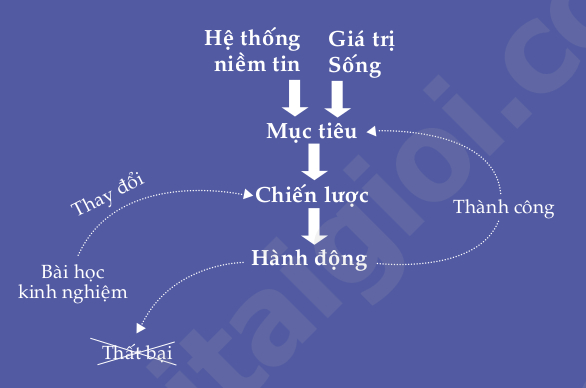

# Master Your Mind, Design Your Destiny
# Làm chủ tư duy thay đổi vận mệnh
* Hãy làm chủ tư duy để thiết kế vận mệnh trong thời đại đầy xáo trộn và phát triển cực nhanh như hiện nay
* Thế giới phải thay đổi và những nhà lãnh đạo là người thay đổi thế giới.

# Chương 1: Những mô thức thành công
* **Hành động để bắt đầu biến ước mơ của bạn thành hiện thực**

## 1.1 Bạn đã có tất cả những điều kiện cần thiết để thành công
* Những điều kiện đó chính là những thứ bẩm sinh bạn đã có sẵn: những khả năng tiềm ẩn bên trong bạn

## 1.2 Tất cả chúng ta đều có "phần cứng" giống nhau

## 1.3 Liên kết thần kinh: chìa khoá dẫn đến những mô thức tư duy và hành động

## 1.4 Nếu bạn sao chép được cách thức tư duy của người thành công, bạn sẽ sao chép được thành công của họ

## 1.5 Tôi đã thay đổi vận mệnh của mình như thế nào
* **Niềm tin chính là công tắc đóng mở những tiềm năng phi thường trong mỗi chúng ta**
* Khi bạn tin là bạn sẽ làm được một điều gì đó, hầu như bạn đã bắt đầu kích hoạt những tiềm năng vô tận của não bộ để hiện thực hóa điều đó. Bạn sẽ vận dụng tất cả năng lực tiềm tàng trong bạn để tìm cách thực hiện và biến niềm tin đó thành sự thật
* Nếu người khác làm được, tôi cũng sẽ làm được. Vấn đề chỉ là ở phương pháp

## 1.6 Từ kém cỏi thành tài năng

## 1.7 Tôi tài giỏi, bạn cũng thế!

## 1.8 Nếu tôi có thể thành công trong học tập, tôi có thể thành công trong mọi lĩnh vực mình muốn

## 1.9 Sự ra đời của khóa học "Những mô thức thành công"

## 1.10 Stuart Tan - Mẫu mực của người giao tiếp kiệt xuất

## 1.11 Bây giờ đến lượt bạn. Hãy bắt đầu khám phá tài năng trong chính bạn!

## 1.12 Sống hết mình và bạn sẽ thành công
* Không có bất kỳ một quyển sách, một khóa đào tạo hay một diễn giả nào có thể "hô biến" bạn thành người thành công trong cuộc sống, trừ phi bản thận bạn thật sự nỗ lực hành động một cách có phương pháp
* Thượng Đế nói với Bruce: **"Nếu con muốn thấy điều kỳ diệu trong cuộc sống của mình, hãy trở thành điều ký diệu đó"**
* Bạn là người duy nhất có được quyền năng thay đổi chính bản thân mình, thông qua việc sử dụng những kiến thức tôi sẽ chia sẻ với bạn

## 1.13 Bốn loại tư tưởng cơ bản của con người khi đọc sách
1. Chắc chắn sẽ không hiệu quả
2. Để xem thử coi sao
3. Hãy làm thử xem sao
4. Tôi sẽ dốc toàn lực đọc và thực hành quyển sách này
	* Đọc sách, gạch dưới những ý quan trọng
	* Trong quá trình đọc, suy nghĩ về những gì họ đọc
	* Làm mọi bài tập một cách nghiêm túc nhất có thể
	* Áp dụng những ý tưởng học được vào cuộc sống
	
## 1.14 Bài tập cuối chương
* Hãy viết ra ít nhất 5 kết quả mà bạn muốn đạt được từ việc đọc quyển sách này

* Hãy viết ra ít nhất 3 mục tiêu lớn (càng cụ thể càng tốt) mà bạn muốn đạt được trong vòng hai năm tới

* Hãy kể ra những suy nghĩ hạn hẹp và những thói quen xấu đang ngăng cản bạn thực hiện mục tiêu của mình

## 1.15 Tổng kết chương
1. Tất cả chúng ta đều có sẵn những tiềm năng trí tuệ để đạt được bất kỳ thành công nào trong cuộc sống. Chúng ta chỉ thiếu kỹ năng và phương pháp cần thiết để phát huy, điều khiển và sử dụng các tiềm năng đó.

2. Với những tiềm năng trí tuệ được tận dụng đúng cách, bạn sẽ thu hút được nguồn lực và sự hỗ trợ cần thiết khác để thành công.

3. Tất cả chúng ta đều có hệ thần kinh như nhau với khoảng 100 tỉ tế bào thần kinh ("phần cứng"). Điều khiến cho mọi người trở nên khác nhau về trí thông mình, suy nghĩ, thói quen và hành động chính là những liên kết thần kinh được tạo ra từ những kích thích khác nhau.

4. Nếu chúng ta có thể sao chép và cài đặt được các "chương trình" ưu việt của những người thành đạt lên "phần cứng" của mình, chúng ta cũng có thể đạt được những thành công như họ.

# Chương 2: Công thức thành công tuyệt đỉnh
> "Thành công là một người thấy tồi. Nó khiến những người thông mình cho rằng họ không thể thất bại." - Bill Gates

* Những người thành công đều làm theo một số bước nhất định để đạt được những gì họ muốn. **Tôi gọi tập hợp những bước này là Công thức Thành Công Tuyệt Đỉnh**
* 2 yếu tố nền tảng quyết định bạn có làm đúng các bước
	* Hệ thống niềm tin
	* Những giá trị sống của bạn

## 2.1 Yếu tố nền tảng thứ nhất: Hệ thống niềm tin mạnh mẽ
* Niềm tin là công tắc đóng mở khả năng tư duy và tiềm năng nội tại

## 2.2 Yếu tố nền tảng thứ hai: Giá trị sống là động lực thúc đẩy bạn
* Là những thứ bạn xem trọng trong cuộc sống như thành công, tự do, an toàn, tình cảm, hạnh phúc
* Cho dù những giá trị sống của bạn là gì, chúng cũng cần phải tương ứng với những mơ ước của bạn

## 2.3 Bước 1. Đặt ra mục tiêu rõ ràng
* Tất cả mọi thành công đều là kết quả của những mục tiêu rõ ràng đã được xác định từ trước đó rất lâu, cộng với sự phấn đấu không ngừng nghỉ trong một thời gian dài

## 2.4 Bước 2. Phát triển một chiến lược hợp lý
* Mục tiêu => Chiến lược
* Một trong những chiến lược để thành công là học hỏi từ những người thành công, học những chiến lược mà họ dùng

## 2.5 Bước 3. Hành động kiên định
* Mục tiêu => Chiến lược => Hành động
* Nếu bạn không hài lòng với cuộc sống luẩn quẩn của mình, hãy LÀM một cái gì đó để thay đổi nó
* Không bao giờ ngừng học hỏi (một dạng hành động kiên định)
* **Kỹ năng làm chủ bản thân** khả năng định hướng và điểu khiển trạng thái cảm xúc của mình để dẫn đến những hành động tích cực và vươn tới những thành công cao nhất

## 2.6 Bước 4. Biến thất bại thành bài học kinh nghiệm
* Mục tiêu => Chiến lược => Hành động => Thành công => Mục tiêu
	* Hành động => Thất bại
* Những người thành công nhất cũng luôn là những người gặp nhiều thất bại hơn cả

## 2.7 Ba cách con người phản ứng trước thất bại
1. **Bào chữa, biện minh, đổ lỗi và nhanh chóng bỏ cuộc**
	* Hãy suy nghĩ và viết ra những lần bạn tự biện hộ cho mình, đổ lỗi cho người khác và từ bỏ mục tiêu
2. **Kiên trì hành động nhưng với cùng một chiến lược không đổi**
	* Hãy suy nghĩ và viết ra những lần bạn thử làm một điều gì đó nhiều lần nhưng không thay đổi chiến lược, dẫn tới việc bạn cảm thấy bế tắc vì không đạt được điều mình muốn và cuối cùng đã bỏ cuộc
3. **Liên tục rút kinh nghiệm, linh hoạt thay đổi chiến lược và kiên trì hành động cho tới khi thành công**
	* Hành động => Bài học kinh nghiệm => Chiến lược mới
	* Họ quyết tâm làm mọi việc cần thiết trong khuôn khổ pháp lý và đạo đức để thành công
	* Mỗi lần bạn không đạt được điều mình muốn => **phản hồi** của cuộc sống cho bạn những thông tin cần thiết => **lắng nghe** và phân tích

## 2.8 Công thức thành công tuyệt đỉnh
1. Xây dựng cho mình một hệ thống niềm tin vững chắc
2. Xác định những giá trị sống của bản thân
3. Biết chính xác bạn muốn gì
4. Phát triển chiến lược phù hợp để đạt được mục tiêu
5. Hành động một cách quyết tâm và kiên định
6. Nếu thành công thì bạn có thể đặt mục tiêu mới to lớn hơn, vĩ đại hơn. Nếu chỉ nhận được phản hồi bạn sẽ rút kinh nghiệm và điều chỉnh chiến lược cho tới khi bạn thật sự thành công

## 2.9 Ứng dụng công thức thành công tuyệt đỉnh vào thực tế

## 2.10 Khóa học những mô thức thành công... cũng đi từ thất bại đến thành công
* Nghiêm túc trong việc ghi nhận "phản hồi" và thay đổi chiến lược
* Hành động bền bỉ và kiên trì áp dụng Công thức thành công tuyệt đỉnh

## 2.11 Hãy linh hoạt để làm chủ được hoàn cảnh
* Tính linh hoạt được định nghĩa là khả năng có thể liên tục thay đổi hoặc điều chỉnh chiến luợc khi cần thiết để đạt được mục tiêu mong muốn

## 2.12 Bài tập cuối chương
* Đã bao giờ bạn thành công nhờ rút kinh nghiệm từ những phản hồi và linh hoạt thay đổi chiến lược chưa? Hay viết ra ít nhất 3 trường hợp. // TODO
* Có những lĩnh vực nào trong cuộc sống của mình, bạn thấy có thể áp dụng được Công thức thành công tuyệt đỉnh để đạt được những điều bạn luôn mong ước hoặc khoa khát? // TODO

## 2.13 Tổng kết chương
1. Công thức thành công tuyệt đỉnh

2. Có ba cách chúng ta đối mặt với thất bại
    a. Bào chữa, biện minh, đổ lỗi và nhanh chóng bỏ cuộc.
    b. Cố gắng nhiều lần với cùng một chiến lược cho dù thất bại, cho tới khi bế tắc và buộc phải bỏ cuộc.
    c. Nhận phản hồi, rút kinh nghiệm để thay đổi chiến lược, kiên trì hành động cho tới khi có được một kết quả nào đó. Lập lại quá trình này đến khi đạt được mục tiêu mong muốn.

3. Tính linh hoạt là khả năng liên tục thay đổi chiến lược và sẵn sàng làm mọi thứ (trong phạm vi pháp luật và đạo đức) để đạt được kết quả mong muốn.

# Chương 3: Làm thế nào để đạt được bất cứ điều gì bạn mong muốn
> "Không một ai tự thay đổi cho đến khi người ấy cảm thấy buộc phải làm điều đó." - Socrates
* Khi một mục tiêu chẳng là gì ngoài một mong ước mơ hồ, bạn sẽ thấy mình bị những cám dỗ, vật cản, những thất vọng hay thất bại cầm chân.

| 5% đặc biệt | 95% còn lại | 
|-------------|-------------|
| QUYẾT TÂM PHẢI thành công | chỉ ƯỚC, MUỐN, HY VỌNG và THÍCH được thành công |
| Họ biến nó thành việc BUỘC PHẢI LÀM | Họ chỉ làm khi thấy tiện lợi thoải mái |
| Họ làm bất cứ điều gì cần làm trong khuôn khổ pháp luật và đạo đức | Họ cứ viện cớ cho việc không làm gì cả |

## 3.1 Khi một mục tiêu trở thành điều BUỘC PHẢI ĐẠT ĐƯỢC... chúng ta sẽ hành động với một tâm thế hoàn toàn khác.
* Khi một điều gì đó trở thành việc phải làm, bạn sẽ cố gắng hết sức để "lôi" mình ra khỏi "chỗ trú ẩn" thoải mái vốn có, và thay đổi chiến lược của mình liên tục, bất kể bao nhiêu lần, miễn là cần thiết để đạt được thành công.
* Những người thành công là những người thật sự chứng tỏ được quyết tâm sắt đá của mình

> "Bạn sẽ không bao giờ đạt được bất cứ điều gì trong đời trừ khi bạn biến nó thành việc PHẢI LÀM" - Adam Khoo

## 3.2 Khi bạn đặt mình vào thế bắt buộc phải thành công thì bao giờ bạn cũng sẽ tìm ra cách
* Ngay khi một mục tiêu trở thành điều BẮT BUỘC PHẢI LÀM, nó lập tức sẽ giúp bạn tận dụng trực tiếp người lực vô hạn trong chính bản thân bạn

## 3.3 Ước muốn của bạn là "Bắt buộc phải đạt được" hay chỉ "Được thì tốt không thì thôi"?
* Biến mục tiêu thành một thứ bắt buộc phải đạt được bằng mọi cách

## 3.4 Những thành tựu bạn đạt được đều là những điều "bắt buộc" đối với bạn
* *Cho nên, nếu đến nay bạn chưa từng đạt được bất cứ thành tựu nào đáng kể, thì đó là do chưa có điều gì trong đời được bạn xem là "buộc phải đạt được".*

* Viết ra năm mục tiêu hoặc nhiệm vụ mà bạn đã trì hoãn nhưng cuối cùng cũng thực hiện được
    1. // TODO
    2. // TODO
    3. // TODO
    4. // TODO
    5. // TODO
    
* Viết ra năm mục tiêu hoặc nhiệm vụ mà bạn đã "lãng quên" cho đến thời điểm này
    1. // TODO
    2. // TODO
    3. // TODO
    4. // TODO
    5. // TODO
    
* Điều khiến bạn cứ mãi trì hoãn, hoặc thậm chí lãng quên những mơ ước hoặc nhiệm vụ của mình là bởi vì chúng chưa trở thành điều bắt buộc đối với bạn => nâng cao **"Ngưỡng chấp nhận"** 

## 3.5 Không phải những gì bạn mong muốn, mà chính những gì bạn sẵn sàng chấp nhận quyết định chất lượng cuộc sống của bạn
* Cách chúng ta nhìn nhận bản thân như thế nào chính là yếu tố quyết định **Ngưỡng Kỳ Vọng** và **Ngưỡng Chấp Nhận** của chúng ta trong cuộc sống

## 3.6 Để thành công, bạn phải nâng cao "Ngưỡng Chấp Nhận" của mình

## 3.7 Có phải bạn đang mặc kẹt giữa hai ngưỡng của mình?

## 3.8 Cảm giác "Không thỏa mãn" và "Đầy cảm hứng" thúc đẩy bạn tiến lên
* Nâng cao tiêu chuẩn (hay Ngưỡng Chấp Nhận) của bản thân => phải có cảm giác "chưa thỏa mãn" (một cách tích cực)

## 3.9 Bất thình lình, tôi thấy mình bé nhỏ...

## 3.10 Ngưỡng Kỳ Vọng và Ngưỡng Chấp Nhận của bạn là gì?
### Ngưỡng Kỳ Vọng // TODO
* **Mức thu nhập**: Mức thu nhập mà bạn kỳ vọng là bao nhiêu?
* **Lối sống**: Lối sống lý tưởng nhất đối với bạn là như thế nào?
* **Sức khỏe**: Bạn muốn sức khẻo lý tưởng, cân nặng lý tưởng, thể hình lý tưởng ra sao?
* **Sự nghiệp**: Bạn muốn đạt được những thành tựu to lớn vĩ đại nào trong bước đường sự nghiệp hoặc trong kinh doanh?
* **Các mối quan hệ cá nhân**: Bạn muốn nuôi dưỡng những mối quan hệ với bạn bè và gia đình một cách toàn vẹn như thế nào?

### Ngưỡng Chấp Nhận // TODO
* **Mức thu nhập**: Mức thu nhập mà bạn chấp nhận được là bao nhiêu?
* **Lối sống**: Lối sống chấp nhận được đối với bạn là như thế nào?
* **Sức khỏe**: Bạn muốn sức khẻo lý tưởng, cân nặng lý tưởng, thể hình chấp nhận được ra sao?
* **Sự nghiệp**: Những gì là chấp nhận được đối với bạn trong trong bước đường sự nghiệp hoặc trong kinh doanh?
* **Các mối quan hệ cá nhân**: Những mối quan hệ với bạn bè và gia đình mà bạn chấp nhận được là như thế nào?

* **Suy ngẫm**: Bạn có thấy sự khác biệt rất lớn giữa những gì bạn kỳ vọng và những gì bạn chấp nhận không? Khi nghĩ về điều đó, có phải bạn bắt đầu nhận ra rằng cuộc sống của bạn chính là kết quả của Ngưỡng Chấp Nhận mà bạn đề ra cho mình?

## 3.11 Môi trường xã hội mà bạn sống góp phần quyết định các tiêu chuẩn của bạn
| Tên người | Mức thu nhập ước |
|-----------|------------------|
|1. TODO    |                  |
|2. TODO    |                  |
|3. TODO    |                  |
|4. TODO    |                  |
|5. TODO    |                  |

* Nếu bạn muốn vươn mình cao hơn để nâng Ngưỡng Chấp Nhận của bạn lên, thì bạn cũng cần đầu tư thời gian cho những người có thể thúc đẩy bạn tiến lên phía trước, những người không ngừng nâng cao tiêu chuẩn của mình.

## 3.12 Nâng cao Ngưỡng Kỳ Vọng và Ngưỡng Chấp Nhận của mình
* Những tiêu chuẩn mới mà bạn đề ra cho mình.
* Những việc bạn sẽ làm để biến chúng thành điều bắt buộc
* Nghĩ ra 3 người mà bạn muốn dành nhiều thời gian với họ bởi vì họ sẽ truyền cảm hứng cho bạn cũng như khiến bạn cảm thấy không còn thỏa mãn với sự trung bình của mình nữa.

* **Mức thu nhập**: Bạn cần bao nhiêu tiền để thật sự sống thoải mái? Kể tên 3 người mà bạn muốn dành nhiều thời gian ở bên họ
* **Lối sống**: Bạn muốn sống như thế nào? (Đó không nhất thiết phải là một cuộc sống hào nhoáng. Có người thích lối sống đơn giản nhưng độc lập về tài chính). Kể tên 3 người mà bạn muốn dành nhiều thời gian ở bên họ
* **Sức khỏe**: Bạn muốn mình cân nặng bao nhiêu? Bạn phải có một cơ thể khẻo mạnh như thế nào?
**Sự nghiệp**: Bạn cần mức độ thăng tiến như thế nào trên con đường sự nghiệp và kinh doanh?
**Các mối quan hệ cá nhân**: Kiểu và chất lượng các mối quan hệ gia đình, bạn bè mà bạn nhất định phải đạt được là gì?

## 3.13 Đặt mình vào thế phải hành động!
* Hãy đặt mình vào tình thế không có đường thoái lui
* Nói cách khác, hãy đặt mình vào tình huống mà bạn không còn sự lựa chọn nào khác ngoài việc phải hành động để đi đến thành công!

## 3.14 Bắt đầu đặt bản thân vào thế phải hành động ngay bây giờ
* Đặt mình vào thế phải hành động
    1. Báo cho "cả thế giới" biết về những mục tiêu to lớn của bạn
    2. Khiến một số người khác tham gia vào quá trình vươn tới thành công của bạn
    3. Bỏ ra một số tiền đầu tư nho nhỏ nhưng đủ để bạn cảm thấy "đau lòng" nếu bạn không cố gắng tận dụng số tiền đó
    
## 3.15 Tôi đặt mình vào tình thế không thể thoái lui hết lần này đến lần khác
* Ý tưởng chính ở đây là bạn phải biết đặt mình vào hoàn cảnh khiến bạn cảm thấy việc bỏ cuộc là hết sức "đau đớn, khó khăn" so với việc kiên trì theo đuổi mục tiêu của mình
 
* Những mục tiêu tôi phải đạt được và cách tôi sẽ biến chúng thành điều bắt buộc
    1. // TODO
    2. // TODO
    3. // TODO
    4. // TODO
    5. // TODO

## 3.16 Sử dụng ngôn từ mạnh mẽ
* Bằng việc lắng nghe "khẩu khí" của những người chung quanh, bạn có thể đoán được mức độ quyết tâm của họ trong việc tiến hành một việc gì đó
* Sư dụng những từ ngữ manh mẹ như "phải", "cần phải", "buộc phải",... thay vì những từ ngữ "thích được", "mong muốn", "mong có thể", "hy vọng có thể",...
* Mỗi khi bạn trì hoãn không chịu làm một việc gì mà bạn cảm thấy nên làm, hãy chú ý vào cách bạn tự nói với bản thân mình

## 3.17 Tổng kết chương
1. Hầu hết các mục tiêu mà con người đưa ra chẳng là gì khác ngoài những ước muốn nhạt nhẽo yếu ớt. Thế nên, họ bao giờ cũng tìm cớ nấn ná trong vòng thoải mãi của mình và trì hoãn hành động.
2. **Cách duy nhất có thể giúp bạn đạt được bất cứ điều gì mình muốn là hạ quyết tâm làm điều đó như một điều bắt buộc.**
3. Khi bạn quyết tâm làm bằng được một điều gì đó, bạn nhất định sẽ tìm ra cách. Ở đâu có ý chí, ở đó có con đường
4. **Ai trong chúng ta cũng có Ngưỡng Kỳ Vọng và Ngưỡng Chấp Nhận của riêng mình. Và ai cũng có xu hướng nghiên về Ngưỡng Chấp Nhận hơn là cố gắng hướng tới Ngưỡng Kỳ Vọng.**
5. Bạn phải nâng cao Ngưỡng Chấp Nhận bằng cách thiết lập mối quan hệ với những người hơn hẳn mình, dù trong việc chơi thể thao, học tập, làm cha mẹ hay trong sự nghiệp. Những người hơn hẳn bạn là những người sẽ truyền cảm hứng giúp bạn tiến lên và khiến bạn không thể ngủ quên trên vòng nguyệt quế của ngày hôm qua.
6. **Bạn phải đặt mình vào tình thế không thể rút lui nếu bạn muốn đạt được một điều gì đó. Hãy làm cho cả bàn dân thiên hạ biết quyết tâm của mình và như thế bạn sẽ không còn cách nào khác ngoài việc phải thành công.**
7. Ngôn từ mà bạn dùng tác động đến suy nghĩ và xúc cảm của bạn. Hãy luôn sử dụng những từ ngữ mạnh mẽ như "phai", "buộc phải", "cần phài",... để chúng giúp bạn luôn ở trong tâm thế đầy động lực và sáng tạo.

# Chương 4: Chìa khóa của sức mạnh tuyệt đối
* Làm thế nào để trở thành bậc thầy về giao tiếp?

# Chương 5: Sức mạnh không tưởng của niềm tin
* Năm bước giúp bạn thay đổi niềm tin tiêu cực

# Chương 6: Bí quyết làm việc đạt hiệu quả tối đa
* Cách thức quản lý cảm xúc của bản thân

# Chương 7: Điều khiển não bộ của bạn để đạt kết quả tối ưu
* Mô thức vút nhanh: phương pháp thay đổi thói quen xấu

# Chương 8: Neo cảm xúc: cần điểu khiển cảm xúc của bạn
* Ba loại neo cảm xúc ảnh hưởng đến cuộc sống của bạn như thế nào?

# Chương 9: Tìm ý nghĩa tích cực của sự việc
* Nghệ thuật chuyển hóa ý nghĩa tiêu cực thành tích cực

# Chương 10: Các giá trị sống: động lực phấn đấu của bạn
* Thay đổi giá trị sống: thay đổi cuộc sống

# Chương 11: Thiết kế vận mệnh
* Quy trình 7 bước giúp bạn đạt được mục tiêu đề ra

