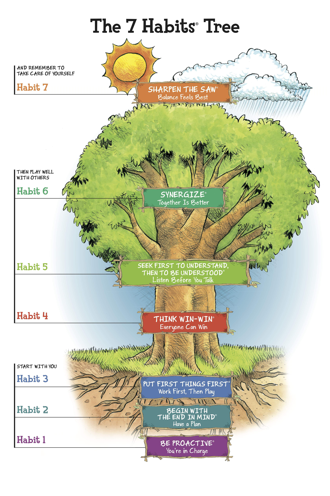
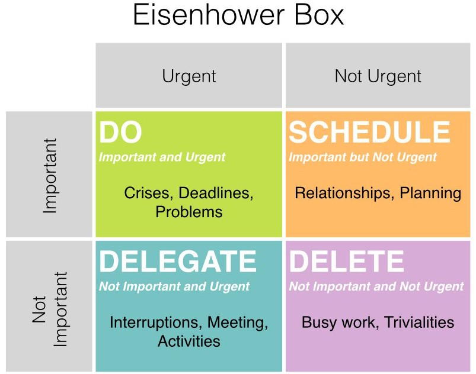

# Being an Effective Cuder
* Effective: đúng
* Effeciency: hiệu quả

# 7 Habits tree

# Start with you
* Be proactive
* Begin with the end in mind
* Put first thing first

# 1. Be Proactive

## 1.1 How to be Proactive - 5P
* Predict
* Prevent
* Plan
* Participate
* Perform

## 1.2 How - Agile/Scrum way

# 2. Begin with the end in mind

## 2.1 Priciple
> If you don't know where you are GOING any road will get you there

> Everything is created twice, first in the mind and then in reality

## 2.2 How
* S.M.A.R.T criteria
  * Specific
  * Measurable
  * Assignable
  * Realistic
  * Time-related
* I Plan what I will do and I do what I've planned

# 3. Put first thing first
> If you spend time and energy on small stuff, you will not have time for really important thing.

## 3.1 How
1. Stop planning - start doing
2. Learn to say no
3. Better done than perfect
4. Get everything out of your head
5. Review and measure your accomplishments

## 3.2 How The Eisenhower box

> You don't have to be great to START. But you have to start to be GREAT
