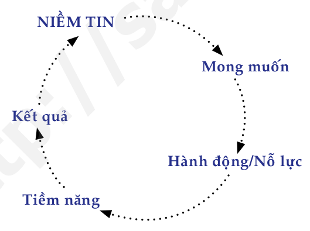
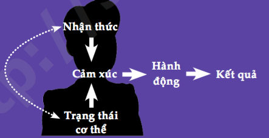
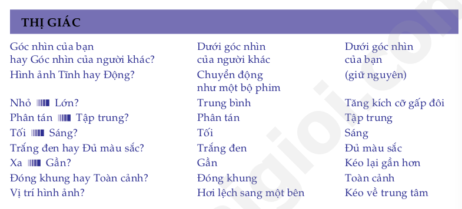
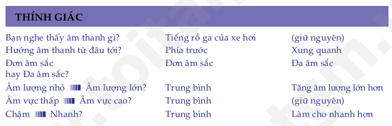
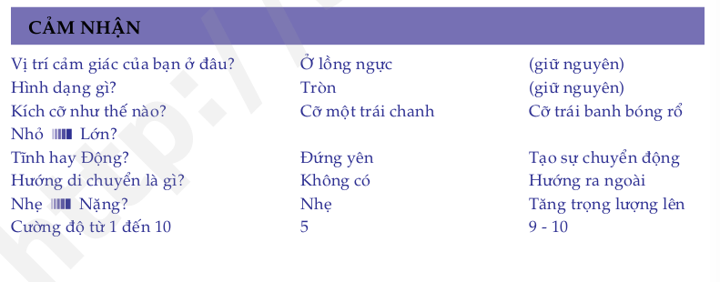

# Master Your Mind, Design Your Destiny
# Làm chủ tư duy thay đổi vận mệnh
* Hãy làm chủ tư duy để thiết kế vận mệnh trong thời đại đầy xáo trộn và phát triển cực nhanh như hiện nay
* Thế giới phải thay đổi và những nhà lãnh đạo là người thay đổi thế giới.

# Chương 1: Những mô thức thành công
* **Hành động để bắt đầu biến ước mơ của bạn thành hiện thực**

## 1.1 Bạn đã có tất cả những điều kiện cần thiết để thành công
* Những điều kiện đó chính là những thứ bẩm sinh bạn đã có sẵn: những khả năng tiềm ẩn bên trong bạn

## 1.2 Tất cả chúng ta đều có "phần cứng" giống nhau

## 1.3 Liên kết thần kinh: chìa khoá dẫn đến những mô thức tư duy và hành động

## 1.4 Nếu bạn sao chép được cách thức tư duy của người thành công, bạn sẽ sao chép được thành công của họ

## 1.5 Tôi đã thay đổi vận mệnh của mình như thế nào
* **Niềm tin chính là công tắc đóng mở những tiềm năng phi thường trong mỗi chúng ta**
* Khi bạn tin là bạn sẽ làm được một điều gì đó, hầu như bạn đã bắt đầu kích hoạt những tiềm năng vô tận của não bộ để hiện thực hóa điều đó. Bạn sẽ vận dụng tất cả năng lực tiềm tàng trong bạn để tìm cách thực hiện và biến niềm tin đó thành sự thật
* Nếu người khác làm được, tôi cũng sẽ làm được. Vấn đề chỉ là ở phương pháp

## 1.6 Từ kém cỏi thành tài năng

## 1.7 Tôi tài giỏi, bạn cũng thế!

## 1.8 Nếu tôi có thể thành công trong học tập, tôi có thể thành công trong mọi lĩnh vực mình muốn

## 1.9 Sự ra đời của khóa học "Những mô thức thành công"

## 1.10 Stuart Tan - Mẫu mực của người giao tiếp kiệt xuất

## 1.11 Bây giờ đến lượt bạn. Hãy bắt đầu khám phá tài năng trong chính bạn!

## 1.12 Sống hết mình và bạn sẽ thành công
* Không có bất kỳ một quyển sách, một khóa đào tạo hay một diễn giả nào có thể "hô biến" bạn thành người thành công trong cuộc sống, trừ phi bản thận bạn thật sự nỗ lực hành động một cách có phương pháp
* Thượng Đế nói với Bruce: **"Nếu con muốn thấy điều kỳ diệu trong cuộc sống của mình, hãy trở thành điều ký diệu đó"**
* Bạn là người duy nhất có được quyền năng thay đổi chính bản thân mình, thông qua việc sử dụng những kiến thức tôi sẽ chia sẻ với bạn

## 1.13 Bốn loại tư tưởng cơ bản của con người khi đọc sách
1. Chắc chắn sẽ không hiệu quả
2. Để xem thử coi sao
3. Hãy làm thử xem sao
4. Tôi sẽ dốc toàn lực đọc và thực hành quyển sách này
	* Đọc sách, gạch dưới những ý quan trọng
	* Trong quá trình đọc, suy nghĩ về những gì họ đọc
	* Làm mọi bài tập một cách nghiêm túc nhất có thể
	* Áp dụng những ý tưởng học được vào cuộc sống
	
## 1.14 Bài tập cuối chương
* Hãy viết ra ít nhất 5 kết quả mà bạn muốn đạt được từ việc đọc quyển sách này

* Hãy viết ra ít nhất 3 mục tiêu lớn (càng cụ thể càng tốt) mà bạn muốn đạt được trong vòng hai năm tới

* Hãy kể ra những suy nghĩ hạn hẹp và những thói quen xấu đang ngăng cản bạn thực hiện mục tiêu của mình

## 1.15 Tổng kết chương
1. Tất cả chúng ta đều có sẵn những tiềm năng trí tuệ để đạt được bất kỳ thành công nào trong cuộc sống. Chúng ta chỉ thiếu kỹ năng và phương pháp cần thiết để phát huy, điều khiển và sử dụng các tiềm năng đó.

2. Với những tiềm năng trí tuệ được tận dụng đúng cách, bạn sẽ thu hút được nguồn lực và sự hỗ trợ cần thiết khác để thành công.

3. Tất cả chúng ta đều có hệ thần kinh như nhau với khoảng 100 tỉ tế bào thần kinh ("phần cứng"). Điều khiến cho mọi người trở nên khác nhau về trí thông mình, suy nghĩ, thói quen và hành động chính là những liên kết thần kinh được tạo ra từ những kích thích khác nhau.

4. Nếu chúng ta có thể sao chép và cài đặt được các "chương trình" ưu việt của những người thành đạt lên "phần cứng" của mình, chúng ta cũng có thể đạt được những thành công như họ.

# Chương 2: Công thức thành công tuyệt đỉnh
> "Thành công là một người thấy tồi. Nó khiến những người thông mình cho rằng họ không thể thất bại." - Bill Gates

* Những người thành công đều làm theo một số bước nhất định để đạt được những gì họ muốn. **Tôi gọi tập hợp những bước này là Công thức Thành Công Tuyệt Đỉnh**
* 2 yếu tố nền tảng quyết định bạn có làm đúng các bước
	* Hệ thống niềm tin
	* Những giá trị sống của bạn

## 2.1 Yếu tố nền tảng thứ nhất: Hệ thống niềm tin mạnh mẽ
* Niềm tin là công tắc đóng mở khả năng tư duy và tiềm năng nội tại

## 2.2 Yếu tố nền tảng thứ hai: Giá trị sống là động lực thúc đẩy bạn
* Là những thứ bạn xem trọng trong cuộc sống như thành công, tự do, an toàn, tình cảm, hạnh phúc
* Cho dù những giá trị sống của bạn là gì, chúng cũng cần phải tương ứng với những mơ ước của bạn

## 2.3 Bước 1. Đặt ra mục tiêu rõ ràng
* Tất cả mọi thành công đều là kết quả của những mục tiêu rõ ràng đã được xác định từ trước đó rất lâu, cộng với sự phấn đấu không ngừng nghỉ trong một thời gian dài

## 2.4 Bước 2. Phát triển một chiến lược hợp lý
* Mục tiêu => Chiến lược
* Một trong những chiến lược để thành công là học hỏi từ những người thành công, học những chiến lược mà họ dùng

## 2.5 Bước 3. Hành động kiên định
* Mục tiêu => Chiến lược => Hành động
* Nếu bạn không hài lòng với cuộc sống luẩn quẩn của mình, hãy LÀM một cái gì đó để thay đổi nó
* Không bao giờ ngừng học hỏi (một dạng hành động kiên định)
* **Kỹ năng làm chủ bản thân** khả năng định hướng và điểu khiển trạng thái cảm xúc của mình để dẫn đến những hành động tích cực và vươn tới những thành công cao nhất

## 2.6 Bước 4. Biến thất bại thành bài học kinh nghiệm
* Mục tiêu => Chiến lược => Hành động => Thành công => Mục tiêu
	* Hành động => Thất bại
* Những người thành công nhất cũng luôn là những người gặp nhiều thất bại hơn cả

## 2.7 Ba cách con người phản ứng trước thất bại
1. **Bào chữa, biện minh, đổ lỗi và nhanh chóng bỏ cuộc**
	* Hãy suy nghĩ và viết ra những lần bạn tự biện hộ cho mình, đổ lỗi cho người khác và từ bỏ mục tiêu
2. **Kiên trì hành động nhưng với cùng một chiến lược không đổi**
	* Hãy suy nghĩ và viết ra những lần bạn thử làm một điều gì đó nhiều lần nhưng không thay đổi chiến lược, dẫn tới việc bạn cảm thấy bế tắc vì không đạt được điều mình muốn và cuối cùng đã bỏ cuộc
3. **Liên tục rút kinh nghiệm, linh hoạt thay đổi chiến lược và kiên trì hành động cho tới khi thành công**
	* Hành động => Bài học kinh nghiệm => Chiến lược mới
	* Họ quyết tâm làm mọi việc cần thiết trong khuôn khổ pháp lý và đạo đức để thành công
	* Mỗi lần bạn không đạt được điều mình muốn => **phản hồi** của cuộc sống cho bạn những thông tin cần thiết => **lắng nghe** và phân tích

## 2.8 Công thức thành công tuyệt đỉnh
1. Xây dựng cho mình một hệ thống niềm tin vững chắc
2. Xác định những giá trị sống của bản thân
3. Biết chính xác bạn muốn gì
4. Phát triển chiến lược phù hợp để đạt được mục tiêu
5. Hành động một cách quyết tâm và kiên định
6. Nếu thành công thì bạn có thể đặt mục tiêu mới to lớn hơn, vĩ đại hơn. Nếu chỉ nhận được phản hồi bạn sẽ rút kinh nghiệm và điều chỉnh chiến lược cho tới khi bạn thật sự thành công

## 2.9 Ứng dụng công thức thành công tuyệt đỉnh vào thực tế

## 2.10 Khóa học những mô thức thành công... cũng đi từ thất bại đến thành công
* Nghiêm túc trong việc ghi nhận "phản hồi" và thay đổi chiến lược
* Hành động bền bỉ và kiên trì áp dụng Công thức thành công tuyệt đỉnh

## 2.11 Hãy linh hoạt để làm chủ được hoàn cảnh
* Tính linh hoạt được định nghĩa là khả năng có thể liên tục thay đổi hoặc điều chỉnh chiến luợc khi cần thiết để đạt được mục tiêu mong muốn

## 2.12 Bài tập cuối chương
* Đã bao giờ bạn thành công nhờ rút kinh nghiệm từ những phản hồi và linh hoạt thay đổi chiến lược chưa? Hay viết ra ít nhất 3 trường hợp. // TODO
* Có những lĩnh vực nào trong cuộc sống của mình, bạn thấy có thể áp dụng được Công thức thành công tuyệt đỉnh để đạt được những điều bạn luôn mong ước hoặc khoa khát? // TODO

## 2.13 Tổng kết chương
1. Công thức thành công tuyệt đỉnh

2. Có ba cách chúng ta đối mặt với thất bại
    a. Bào chữa, biện minh, đổ lỗi và nhanh chóng bỏ cuộc.
    b. Cố gắng nhiều lần với cùng một chiến lược cho dù thất bại, cho tới khi bế tắc và buộc phải bỏ cuộc.
    c. Nhận phản hồi, rút kinh nghiệm để thay đổi chiến lược, kiên trì hành động cho tới khi có được một kết quả nào đó. Lập lại quá trình này đến khi đạt được mục tiêu mong muốn.

3. Tính linh hoạt là khả năng liên tục thay đổi chiến lược và sẵn sàng làm mọi thứ (trong phạm vi pháp luật và đạo đức) để đạt được kết quả mong muốn.

# Chương 3: Làm thế nào để đạt được bất cứ điều gì bạn mong muốn
> "Không một ai tự thay đổi cho đến khi người ấy cảm thấy buộc phải làm điều đó." - Socrates
* Khi một mục tiêu chẳng là gì ngoài một mong ước mơ hồ, bạn sẽ thấy mình bị những cám dỗ, vật cản, những thất vọng hay thất bại cầm chân.

| 5% đặc biệt | 95% còn lại | 
|-------------|-------------|
| QUYẾT TÂM PHẢI thành công | chỉ ƯỚC, MUỐN, HY VỌNG và THÍCH được thành công |
| Họ biến nó thành việc BUỘC PHẢI LÀM | Họ chỉ làm khi thấy tiện lợi thoải mái |
| Họ làm bất cứ điều gì cần làm trong khuôn khổ pháp luật và đạo đức | Họ cứ viện cớ cho việc không làm gì cả |

## 3.1 Khi một mục tiêu trở thành điều BUỘC PHẢI ĐẠT ĐƯỢC... chúng ta sẽ hành động với một tâm thế hoàn toàn khác.
* Khi một điều gì đó trở thành việc phải làm, bạn sẽ cố gắng hết sức để "lôi" mình ra khỏi "chỗ trú ẩn" thoải mái vốn có, và thay đổi chiến lược của mình liên tục, bất kể bao nhiêu lần, miễn là cần thiết để đạt được thành công.
* Những người thành công là những người thật sự chứng tỏ được quyết tâm sắt đá của mình

> "Bạn sẽ không bao giờ đạt được bất cứ điều gì trong đời trừ khi bạn biến nó thành việc PHẢI LÀM" - Adam Khoo

## 3.2 Khi bạn đặt mình vào thế bắt buộc phải thành công thì bao giờ bạn cũng sẽ tìm ra cách
* Ngay khi một mục tiêu trở thành điều BẮT BUỘC PHẢI LÀM, nó lập tức sẽ giúp bạn tận dụng trực tiếp người lực vô hạn trong chính bản thân bạn

## 3.3 Ước muốn của bạn là "Bắt buộc phải đạt được" hay chỉ "Được thì tốt không thì thôi"?
* Biến mục tiêu thành một thứ bắt buộc phải đạt được bằng mọi cách

## 3.4 Những thành tựu bạn đạt được đều là những điều "bắt buộc" đối với bạn
* *Cho nên, nếu đến nay bạn chưa từng đạt được bất cứ thành tựu nào đáng kể, thì đó là do chưa có điều gì trong đời được bạn xem là "buộc phải đạt được".*

* Viết ra năm mục tiêu hoặc nhiệm vụ mà bạn đã trì hoãn nhưng cuối cùng cũng thực hiện được
    1. // TODO
    2. // TODO
    3. // TODO
    4. // TODO
    5. // TODO
    
* Viết ra năm mục tiêu hoặc nhiệm vụ mà bạn đã "lãng quên" cho đến thời điểm này
    1. // TODO
    2. // TODO
    3. // TODO
    4. // TODO
    5. // TODO
    
* Điều khiến bạn cứ mãi trì hoãn, hoặc thậm chí lãng quên những mơ ước hoặc nhiệm vụ của mình là bởi vì chúng chưa trở thành điều bắt buộc đối với bạn => nâng cao **"Ngưỡng chấp nhận"** 

## 3.5 Không phải những gì bạn mong muốn, mà chính những gì bạn sẵn sàng chấp nhận quyết định chất lượng cuộc sống của bạn
* Cách chúng ta nhìn nhận bản thân như thế nào chính là yếu tố quyết định **Ngưỡng Kỳ Vọng** và **Ngưỡng Chấp Nhận** của chúng ta trong cuộc sống

## 3.6 Để thành công, bạn phải nâng cao "Ngưỡng Chấp Nhận" của mình

## 3.7 Có phải bạn đang mặc kẹt giữa hai ngưỡng của mình?

## 3.8 Cảm giác "Không thỏa mãn" và "Đầy cảm hứng" thúc đẩy bạn tiến lên
* Nâng cao tiêu chuẩn (hay Ngưỡng Chấp Nhận) của bản thân => phải có cảm giác "chưa thỏa mãn" (một cách tích cực)

## 3.9 Bất thình lình, tôi thấy mình bé nhỏ...

## 3.10 Ngưỡng Kỳ Vọng và Ngưỡng Chấp Nhận của bạn là gì?
### Ngưỡng Kỳ Vọng // TODO
* **Mức thu nhập**: Mức thu nhập mà bạn kỳ vọng là bao nhiêu?
* **Lối sống**: Lối sống lý tưởng nhất đối với bạn là như thế nào?
* **Sức khỏe**: Bạn muốn sức khẻo lý tưởng, cân nặng lý tưởng, thể hình lý tưởng ra sao?
* **Sự nghiệp**: Bạn muốn đạt được những thành tựu to lớn vĩ đại nào trong bước đường sự nghiệp hoặc trong kinh doanh?
* **Các mối quan hệ cá nhân**: Bạn muốn nuôi dưỡng những mối quan hệ với bạn bè và gia đình một cách toàn vẹn như thế nào?

### Ngưỡng Chấp Nhận // TODO
* **Mức thu nhập**: Mức thu nhập mà bạn chấp nhận được là bao nhiêu?
* **Lối sống**: Lối sống chấp nhận được đối với bạn là như thế nào?
* **Sức khỏe**: Bạn muốn sức khẻo lý tưởng, cân nặng lý tưởng, thể hình chấp nhận được ra sao?
* **Sự nghiệp**: Những gì là chấp nhận được đối với bạn trong trong bước đường sự nghiệp hoặc trong kinh doanh?
* **Các mối quan hệ cá nhân**: Những mối quan hệ với bạn bè và gia đình mà bạn chấp nhận được là như thế nào?

* **Suy ngẫm**: Bạn có thấy sự khác biệt rất lớn giữa những gì bạn kỳ vọng và những gì bạn chấp nhận không? Khi nghĩ về điều đó, có phải bạn bắt đầu nhận ra rằng cuộc sống của bạn chính là kết quả của Ngưỡng Chấp Nhận mà bạn đề ra cho mình?

## 3.11 Môi trường xã hội mà bạn sống góp phần quyết định các tiêu chuẩn của bạn
| Tên người | Mức thu nhập ước |
|-----------|------------------|
|1. TODO    |                  |
|2. TODO    |                  |
|3. TODO    |                  |
|4. TODO    |                  |
|5. TODO    |                  |

* Nếu bạn muốn vươn mình cao hơn để nâng Ngưỡng Chấp Nhận của bạn lên, thì bạn cũng cần đầu tư thời gian cho những người có thể thúc đẩy bạn tiến lên phía trước, những người không ngừng nâng cao tiêu chuẩn của mình.

## 3.12 Nâng cao Ngưỡng Kỳ Vọng và Ngưỡng Chấp Nhận của mình
* Những tiêu chuẩn mới mà bạn đề ra cho mình.
* Những việc bạn sẽ làm để biến chúng thành điều bắt buộc
* Nghĩ ra 3 người mà bạn muốn dành nhiều thời gian với họ bởi vì họ sẽ truyền cảm hứng cho bạn cũng như khiến bạn cảm thấy không còn thỏa mãn với sự trung bình của mình nữa.

* **Mức thu nhập**: Bạn cần bao nhiêu tiền để thật sự sống thoải mái? Kể tên 3 người mà bạn muốn dành nhiều thời gian ở bên họ
* **Lối sống**: Bạn muốn sống như thế nào? (Đó không nhất thiết phải là một cuộc sống hào nhoáng. Có người thích lối sống đơn giản nhưng độc lập về tài chính). Kể tên 3 người mà bạn muốn dành nhiều thời gian ở bên họ
* **Sức khỏe**: Bạn muốn mình cân nặng bao nhiêu? Bạn phải có một cơ thể khẻo mạnh như thế nào?
**Sự nghiệp**: Bạn cần mức độ thăng tiến như thế nào trên con đường sự nghiệp và kinh doanh?
**Các mối quan hệ cá nhân**: Kiểu và chất lượng các mối quan hệ gia đình, bạn bè mà bạn nhất định phải đạt được là gì?

## 3.13 Đặt mình vào thế phải hành động!
* Hãy đặt mình vào tình thế không có đường thoái lui
* Nói cách khác, hãy đặt mình vào tình huống mà bạn không còn sự lựa chọn nào khác ngoài việc phải hành động để đi đến thành công!

## 3.14 Bắt đầu đặt bản thân vào thế phải hành động ngay bây giờ
* Đặt mình vào thế phải hành động
    1. Báo cho "cả thế giới" biết về những mục tiêu to lớn của bạn
    2. Khiến một số người khác tham gia vào quá trình vươn tới thành công của bạn
    3. Bỏ ra một số tiền đầu tư nho nhỏ nhưng đủ để bạn cảm thấy "đau lòng" nếu bạn không cố gắng tận dụng số tiền đó
    
## 3.15 Tôi đặt mình vào tình thế không thể thoái lui hết lần này đến lần khác
* Ý tưởng chính ở đây là bạn phải biết đặt mình vào hoàn cảnh khiến bạn cảm thấy việc bỏ cuộc là hết sức "đau đớn, khó khăn" so với việc kiên trì theo đuổi mục tiêu của mình
 
* Những mục tiêu tôi phải đạt được và cách tôi sẽ biến chúng thành điều bắt buộc
    1. // TODO
    2. // TODO
    3. // TODO
    4. // TODO
    5. // TODO

## 3.16 Sử dụng ngôn từ mạnh mẽ
* Bằng việc lắng nghe "khẩu khí" của những người chung quanh, bạn có thể đoán được mức độ quyết tâm của họ trong việc tiến hành một việc gì đó
* Sư dụng những từ ngữ manh mẹ như "phải", "cần phải", "buộc phải",... thay vì những từ ngữ "thích được", "mong muốn", "mong có thể", "hy vọng có thể",...
* Mỗi khi bạn trì hoãn không chịu làm một việc gì mà bạn cảm thấy nên làm, hãy chú ý vào cách bạn tự nói với bản thân mình

## 3.17 Tổng kết chương
1. Hầu hết các mục tiêu mà con người đưa ra chẳng là gì khác ngoài những ước muốn nhạt nhẽo yếu ớt. Thế nên, họ bao giờ cũng tìm cớ nấn ná trong vòng thoải mãi của mình và trì hoãn hành động.
2. **Cách duy nhất có thể giúp bạn đạt được bất cứ điều gì mình muốn là hạ quyết tâm làm điều đó như một điều bắt buộc.**
3. Khi bạn quyết tâm làm bằng được một điều gì đó, bạn nhất định sẽ tìm ra cách. Ở đâu có ý chí, ở đó có con đường
4. **Ai trong chúng ta cũng có Ngưỡng Kỳ Vọng và Ngưỡng Chấp Nhận của riêng mình. Và ai cũng có xu hướng nghiên về Ngưỡng Chấp Nhận hơn là cố gắng hướng tới Ngưỡng Kỳ Vọng.**
5. Bạn phải nâng cao Ngưỡng Chấp Nhận bằng cách thiết lập mối quan hệ với những người hơn hẳn mình, dù trong việc chơi thể thao, học tập, làm cha mẹ hay trong sự nghiệp. Những người hơn hẳn bạn là những người sẽ truyền cảm hứng giúp bạn tiến lên và khiến bạn không thể ngủ quên trên vòng nguyệt quế của ngày hôm qua.
6. **Bạn phải đặt mình vào tình thế không thể rút lui nếu bạn muốn đạt được một điều gì đó. Hãy làm cho cả bàn dân thiên hạ biết quyết tâm của mình và như thế bạn sẽ không còn cách nào khác ngoài việc phải thành công.**
7. Ngôn từ mà bạn dùng tác động đến suy nghĩ và xúc cảm của bạn. Hãy luôn sử dụng những từ ngữ mạnh mẽ như "phai", "buộc phải", "cần phài",... để chúng giúp bạn luôn ở trong tâm thế đầy động lực và sáng tạo.

# Chương 4: Chìa khóa của sức mạnh tuyệt đối
> "Bất cứ ai cũng có tiềm năng làm được những gì mà tôi đã làm và còn nhiều hơn nữa. Tuy nghiên, sẽ có những người thật sự làm được như vậy, trong khi những người khác thì không. Với những người không làm được thì bởi vì chính họ ngăn cản mình chứ không phải cuộc đời này không cho phép họ làm điều đó." - Warrent Buffett

## 4.1 Chịu trách nhiệm hoàn toàn về cuộc sống cho bạn sức mạnh tuyệt đối
* **Phương châm: Chừng nào bạn chịu trách nhiệm hoàn toàn về một việc gì đó thì chừng ấy bạn có quyền kiểm soát nó**

## 4.2 Viện lý do và đổ lỗi cho người khác tước đi sức mạnh của bạn
* **"Mọi người phải thay đổi hoặc hoàn cảnh phải khá hơn... thì mọi việc mới khả dĩ hơn đối với tôi"... Nhưng này, có phải thật sự như thế không?**
* **Trong phần lớn trường hợp, thế giới và cuộc sống của bạn sẽ không thay đổi... trừ khi bạn thay đổi trước!**

## 4.3 Vậy tại sao có quá nhiều người chọn trở thành "nạn nhân"?
* Vì khi làm như vậy, chúng ta cảm thấy "an toàn" hơn
* *** Tuy nhiên, đã đến lúc bạn cần phải biết một sự thật rằng, mặc dù việc đóng vai trò nạn nhân khiến bạn có cảm giac được bù đắp phần nào, thì cái giá của nó cũng rất đắt. Chừng nào bạn còn đổ lỗi cho hoàn cảnh hoặc ai đó đã gây ra những khó khăn cho mình, thì bạn cũng đang dần tự hủy hoại quyền lực tuyệt đối của bản thân để làm chủ cuộc đời mình và thay đổi nó**
* Chịu trách nhiệm !== tự trách mình
* Chịu trách nhiệm có nghĩa là bạn ý thức được rằng, những lựa chọn bạn đưa ra trong quá khứ dẫn đến kết quả ngày hôm nay

## 4.4 Chịu trách nhiệm hoàn toàn về những việc mình làm và hệ quả của nó
> "Xin đừng ngồi đó mà mong mọi việc sẽ tốt hơn, hãy làm cho mình tốt hơn."  - Jim Rohn
* * Hãy tự hỏi mình, "Nếu mình chịu trách nhiệm về việc này, mình có thể làm gì để thay đổi nó?"

## 4.5 Chịu trách nhiệm cho cả những cảm xúc của bạn
* Chừng nào chúng ta còn tiếp tục đổ lỗi cho hoàn cảnh hoặc người khác về những cảm xúc của mình, chừng ấy tình trạng cảm xúc của chúng ta vẫn sẽ nằm ngoài vòng kiểm soát
* Hãy bắt đầu chịu trách nhiệm về những cảm xúc của mình! Làm được như vậy, bạn sẽ có khả năng đưa mình vào những trạng thái cảm xúc mạnh mẽ và tích cực. Hay ít ra, bạn cũng không bị kiểm soát bởi những cảm xúc tiêu cực

## 4.6 Làm thế nào để trở thành bậc thầy về giao tiếp
* Định nghĩa cũ về Giao tiếp thành công: Khi hai người giao tiếp với nhau, cả hai sẽ chia đều trách nhiệm, tức là mỗi phía chịu trách nhiệm 50% cho sự thành công của việc giao tiếp đó.

## 4.7 Chịu trách nhiệm 100% về thành công trong giao tiếp
* Ý nghĩa thật sự trong thông điệp của bạn chính là phản hồi mà bạn nhận được! Hãy luôn điều chỉnh cách thức giao tiếp của mình cho đến khi bạn có được phản hồi mong muốn!
* Chịu trách nhiệm và linh hoạt chính là chìa khóa để trở thành người giao tiếp hiệu quả

## 4.8 Ngôn từ, giọng điệu và ngôn ngữ cơ thể
* **Giao tiếp = Ngôn từ (7%) + Giọng điệu (38%) + Ngôn ngữ cơ thể (55%)**

## 4.9 Không có học trò cứng đầu, chỉ có giáo viên cứng nhắc

## 4.10 Bạn luôn có sự lựa chọn
* **Nếu bạn quyết định chọn cách nghĩ tích cực và những niềm tin có sức mạnh, thế giới quanh bạn sẽ "tự nhiên" dần dần thay đổi theo chiều hướng bạn mong muốn!**

## 4.11 Cuộc sống thay đổi khi bạn thay đổi
* Để mọi sự thay đổi theo chiều hướng tốt hơn, bạn cần phải thay đổi trước. Một khi bạn can đảm chịu trách nhiệm về cuộc sống của mình và thay đổi bản thân, dường như mọi thứ và mọi người cũng dần thay đổi theo cách bạn mong muốn. Đó là sự lựa chọn của bạn, và mọi chuyện diễn ra trong tương lai đều xuất phát từ quyết định của bạn ngày hôm nay
* Nếu bạn cần một phép lạ, hiến biến chính mình thành một phép lạ trước

* Nếu bạn muốn có những đồng nghiệp tốt, hãy là một đồng nghiệp tốt
* Nếu bạn muốn lôi kéo được những nhân viên tài giỏi, hãy là ông/bà chủ tuyệt vời
* Nếu bạn muốn có con ngoan, hãy là bậc cha mẹ gương mẫu
* Nếu bạn muốn có người bạn đời lý tưởng, hãy là người vợ hoặc chồng lý tưởng
* Nếu bạn muốn có thu nhập cao, hãy mang lại lợi ích cho công ty hoặc khách hàng của bạn
* Nếu bạn muốn thu hút những khách hàng tốt, hãy tạo ra những sản phẩm và dịch vụ tốt nhất

* Hãy nói "Tôi chọn" thường xuyên hơn
    * Những từ ngữ chúng ta dùng hàng ngày phản ánh cách chúng ta nghĩ và nhìn nhận về thế giới chung quanh. Khi dùng từ "tôi chọn" thường xuyên hơn, bạn sẽ bắt đầu nhìn mọi vật mọi việc với sức mạnh mới và khả năng kiểm soát cao hơn bạn nghĩ là có thể.
    
| Thay vì nói | Hãy nói |
|-------------|---------|
| Tôi tuyệt vọng | Tôi chọn cảm giác tuyệt vọng |
| Họ không hiểu tôi | Tôi chọn cách giao tiếp làm cho họ không hiểu tôi |
| Doanh thu của công ty giảm sút | Tôi chọn việc cho phép doanh thu công ty đi xuống |
| Nhân viên chẳng có tý động lực làm việc | Tôi chọn việc để mặc cho tinh thần làm việc của nhân viên sa sút |
| Tôi toàn gặp những hậu quả tệ hại | Tội chọn việc gặp phải những kết quả xấu |
| Người ta toàn lợi dụng tôi | Tôi chọn việc để người khác lợi dụng |
| Sức khỏe tôi rất kém | Tôi chọn việc có sức khỏe kém |

## 4.12 Tổng kết chương
1. Dám gánh vác trách nhiệm trong mọi hoàn cảnh mang đến cho bạn sức mạnh để thay đổi nó.
2. Khi chúng ta tự biện hộ, đổ lỗi cho người khác hoặc than phiền, chúng ta tự tước mất quyền kiểm soát của mình, và tự biến mình thành một nạn nhân.
3. Nhiều người thích trở thành "nạn nhân" vì đó là cách tốt nhất để né tránh rắc rối. Tuy nhiên, việc đó lại khiến họ phải trả giá đắt hơn về lâu về dài.
4. Bàn cần phải dám gánh vác trách nhiệm về những kết quả bạn thu được qua hành động của mình, về cảm xúc của bạn và về cách bạn giao tiếp với mọi người
5. Ý nghĩa thông điệp của bạn chính là phản hồi bạn nhận được, bất kể thông điệp bạn muốn chuyển đi là gì. Liên tục thay đổi cách bạn giao tiếp cho đến khi bạn nhận được kết quả mong muốn.
6. Chúng ta thật sự giao tiếp thông qua ngôn từ (7%), giọng điệu (38%) và cử chỉ (55%).
7. Để cuộc sống thay đổi, bạn cần phải thay đổi trước.
8. Dùng cụm từ "Tôi chọn" để nói chuyện với bản thân và mang lại cho mình sức mạnh để thay đổi.

# Chương 5: Sức mạnh không tưởng của niềm tin
> "Niềm tin mạnh mẽ có thể giúp những người bình thường làm được những việc phi thường hoặc không tưởng. Ngược lại, niềm tin giới hạn có thể làm thui chột những con người tài năng nhất."

* Niềm tin quyết định mong muốn
* Niềm tin mạnh mẽ thúc đẩy bạn hành động và quyết định việc bạn sẽ tận dụng được bao nhiều phần trăm tiềm năng của mình

## 5.1 Niềm tin: Chìa khóa mở cánh cửa tiềm năng của bạn

## 5.2 Hiệu ứng Pygmalion
* **Niềm tin của bạn về người khác có thể biến thành sự thật**

## 5.3 Niềm tin của bạn thậm chí có thể ảnh hưởng cơ chế sinh học của bạn

## 5.4 Khi niềm tin có thể chữa được bệnh ung thư

## 5.5 Tâm trí con người không thể phân biệt giữa một trải nghiệm trong thực tế và một trải nghiệm sống động trong tưởng tượng
* Dùng **phương pháp hình dung sáng tạo** để củng cố niềm tin mạnh mẽ

## 5.6 Trái chanh ở đâu?

## 5.7 Diễn tập trong tâm trí - "Vũ khí bí mật" của các vận động viên Nga

## 5.8 So sánh việc luyện tập trong tâm trí và việc luyện tập thể chất

## 5.9 Tôi đã luyện tập trong tâm trí để thi lấy bằng lái xe hơi với điểm số tuyệt đối

## 5.10 Trước khi đạt được kết quả thật sự, bạn phải đạt được nó trong tâm trí trước đã

## 5.11 Phá vỡ niềm tin của cả thế giới
* Trở ngại duy nhất khiến nhiều người không đạt được mục tiêu và không tận dụng tối đa tiềm năng của họ không phải là vì họ không có khả năng, mà do chính niềm tin của họ giới hạn bản thân của họ.

## 5.12 Niềm tin của bạn không bao giờ đúng tuyệt đối cả!
* Nếu niềm tin của bạn đang cản trở bạn, bạn phải thay đổi chúng ngay từ bây giờ!
* * Điều quan trọng không phải là niềm tin đúng hay không mà là việc nó tạo động lực hay cản trở chúng ta hành động
* * Nếu người khác làm được, tôi cũng có thể làm được*
* *Mọi việc xảy ra đều có một ý nghĩa đặc biệt riêng của nó đối với cuộc đời chúng ta*
* *Đằng sau những thử thách là cơ hội đang ẩn mình*

## 5.13 Những gì bạn tin tưởng sẽ trở thành sự thật đối với bạn!
> "Dù bạn tin rằng mình có thể làm được hay không làm được việc gì, thì điều nào cũng đúng!" - Henry Ford

* Ở bất cứ thời điểm nào, bạn không hề trải nghiệm thực tế mà là trải nghiệm nhận thức cá nhân của bạn về thực tế

## 5.14 Điểm mù tri giác... bạn đã bao giờ gặp trường hợp này chưa?
* Nếu bạn tin rằng không có cơ hội xung quanh và thời điểm kinh tế này tệ hại hết chỗ nói, bạn sẽ xóa đi mọi thứ đi ngược lại niềm tin của bạn, và bạn sẽ thấy khó khăn nhan nhản khắp nơi.

## 5.15 Một số người nổi tiếng và thông minh từng hết lòng tin vào những điều mà... hiện nay chúng ta biết là hoàn toàn sai!

## 5.16 Niềm tin được tạo thành như thế nào
* Hầu hết niềm tin đến từ việc bạn mô phỏng những người quan trọng xung quan bạn - như cha mẹ, thầy cô, bạn bè
* Bạn có khuynh hướng tin vào những điều tương tự với những điều mà những người có ảnh hưởng lớn đến cuộc sống của bạn tin tưởng
* Niềm tin là nhận thức và các lý giải mà bạn tạo ra về những kinh nghiệm trong quá khứ
* Niềm tin luôn khởi nguồn từ một nhận định của người khác hay từ một ý tưởng bạn tự nghĩ ra. Khi bạn trải nghiệm nhiều sự việc củng cố cho ý tưởng hay nhận định đó, nó trở nên vững chắc và biến thành niềm tin

## 5.17 "Tôi học dốt toán"... làm thế nào mà tôi có niềm tin này vao lúc năm tuổi

## 5.18 Tôi phá vỡ niềm tin giời hạn này như thế nào
* Thử thách những bằng chứng củng cố niềm tin giới hạn đó. Một khi bẻ gãy chân bàn, niềm tin sẽ sụp đổ

## 5.19 Từ đứa trẻ dốt toán thành thần đồng toán học - bắt đầu chỉ với một niềm tin mới

## 5.20 Bạn có những niềm tin giới hạn nào?
* Sự khác biệt giữa người thành công, người trung bình và kẻ thất bại nằm ở những niềm tin mà họ có được về bản thân và những người xung quanh

## 5.21 Làm thế nào để thay đổi niềm tin
1. Tìm đủ lý do để thay đổi niềm tin
    * Suy nghĩ về những hậu quả do niềm tin giới hạn mang lại cho bạn trong cuộc sống và tương lai sau này
2. Đánh sập những "bằng chứng" tiêu cực gia cố cho niềm tin giới hạn
    * Bằng chứng chống đỡ niềm tin, bằng cách trả lời câu hỏi:
        1. Bạn đã tạo ra niềm tin này như thế nào?
        2. Việc gì đã khiến bạn tin điều này là đúng?
    * Tìm cách đánh gãy chúng, bằng cách trả lời câu hỏi
        1. Điều này còn có ý nghĩa gì khác?
        2. Có ví dụ phản biện nào không?
        3. Người mang lại bằng chứng này có đáng tin cậy không?
3. Tạo ra một niềm tin tích cực mới
4. Tạo ra những bằng chứng mới để cũng cố niềm tin nàynày
5. Tưởng tượng về tương lai và kết hợp tất cả mọi lợi ích của việc nuôi dưỡng niềm tin mới này

## 5.22 Tổng kết chương
1. Niềm tin là những gì thúc đẩy người bình thường đạt được những điều phi thường.
2. Đồng thời, niềm tin giới hạn là rào cản khiến đa số mọi người không đạt được những gì họ thật sự có thể, cho dù họ có tiềm năng đến mức nào.
3. Niềm tin của bạn quyết định những gì bạn mong muốn và có được từ bản thân.
4. Niềm tin của bạn ảnh hưởng đến cơ chế sinh học và sức khỏe của bạn.
5. Tâm trí con người không thể phân biệt giữa một sự việc có thật và một sự việc được tưởng tượng một cách sống động.
6. Bạn có thể đạt hiệu quả tối đa thông qua phương pháp hình dung sáng tạo.
7. Niềm tin không bao giờ đúng tuyệt đối. Niềm tin là những ý kiến và sự đúc kết mà bạn tạo ra về bản thân và thế giới xung quanh
8. Bất cứ những gì bạn tin tưởng sẽ trở thành sự thật đối với bạn.
9. Bạn phải chấp nhận những niềm tin tích cực và thay đổi những niềm tin giới hạn.
10. Niềm tin được hình thành đầu tiên từ một ý tưởng và được củng cố bằng các bằng chứng.
11. Có 5 bước để thay đổi niềm tin
    1. Tìm đủ lý do để thay đổi niềm tin
    2. Đánh gãy những bằng chứng củng cố niềm tin
    3. Tạo ra một niềm tin tích cực mới
    4. Tìm những bằng chứng mới để củng cố niềm tin mới
    5. Nghĩ về tương lại và kết hợp tất cả mọi lợi ích của việc nuôi dưỡng niềm tin mới này

# Chương 6: Bí quyết làm việc đạt hiệu quả tối đa

## 6.1 Hành động tạo ra kết quả
* Thành công được định nghĩa bằng việc bạn hành động như thế nào chứ không phải bằng số lượng kiến thức hay năng lực mà bạn sở hữu
* Kiến thức có thể học được và năng lực có thể đạt được qua thời gian.
* Nhưng hành động là thứ duy nhất xuất phát từ bên trong bản thân bạn. Đó là thứ duy nhất có thể tạo ra kết quả.
* Chỉ có hành động mạnh mẽ mới là chìa khóa giải phóng tiềm năng của bản thân bạn. Do đó, những người biết kết hợp giữa kiến thức và hành động mạnh mẽ mới là kẻ bất khả chiến bại trong việc theo đuổi bất kỳ mục tiêu nào.

## 6.2 Cảm xúc thúc đẩy hành động
* Cảm xúc của bạn mới là "nguồn lực" chính thật sự thúc đẩy hành động và cách cư xử của bạn trong mọi thời điểm. Bản cảm thấy như thế nào thì bạn làm y như thế đó.
* Những người luôn hành động nhất quán và gặt hái kết quả tốt đẹp là do họ lựa chọn để có được cảm xúc tích cực mỗi ngày. Chính những cảm xúc tích cực này cho phép họ tận dụng tối đa tiềm năng của họ và thành công tột bậc
* 10 cảm xúc phổ biến của một người **thành công**
    1. Động lực mạnh mẽ
    2. Phấn khởi
    3. Đam mê
    4. Tràn đầy sinh lực
    5. Tự tin
    6. Căng thẳng (x)
    7. Giận dữ    (x)
    8. Lo lắng    (x)
    9. Vui vẻ
    10. Tò mò
* 10 cảm xúc phổ biến của một người **bình thường**
    1. Nản lòng            (x)
    2. Lo sợ               (x)
    3. Lười biếng          (x)
    4. Trì hoãn            (x)
    5. Phấn khởi
    6. Lo lắng             (x)
    7. Vui vẻ
    8. Mệt mỏi và buồn ngủ (x)
    9. Buồn tẻ             (x)
    10. Phiền muộn         (x)
    
## 6.3 Bạn có làm chủ được cảm xúc của mình không?
* Những người thành công chịu trách nhiệm cho cảm xúc của họ và biết cách điều khiển cảm xúc bản thân một cách có ý thức.
* Những người trung bình, luôn cho rằng cảm xúc của mình thường xuyên bị những thói quen xấu và môi trường xung quanh kiểm soát.

## 6.4 Chính bạn tạo ra cảm xúc của mình
* Không ai và không có bất cứ việc gì có thể ảnh hưởng hay thay đổi cảm xúc của bạn, trừ khi bạn chọn việc cho phép bản thân bạn rơi vào cảm xúc đó.
* Cảm xúc ở mỗi thời điểm được quyết định bởi 2 yếu tố
    1. Trạng thái cơ thể
    2. Cách nhận thức về mọi việc xung quanh
    
## 6.5 Trạng thái cơ thể ảnh hưởng đến cảm xúc của bạn
* Trạng thái cơ thể một cách tổng quan là tình trạng cơ thể và dáng vẻ điệu bộ
* Trình trạng cơ thể tác động trực tiếp đến cảm xúc
* Dáng vẻ điệu bộ cũng ảnh hưởng đến cảm xúc
    * Khi bạn hào hứng, bạn tự động chuyển dáng vẻ điệu bộ vào kiểu hào hứng

## 6.6 Nhận thức ảnh hưởng đến cảm xúc
* Nhận thức: ám chỉ việc bạn nghĩ gì và nghĩ như thế nào. Là cách bạn tái hiện những gì xảy ra xung quanh bên trong tâm trí bạn.
* Những gì bạn nhận thức được không phải là những gì xảy ra trong thực tế mà là hình ảnh tái hiện của thực tế bên trong tâm trí bạn.
* Những yếu tố chính sàng lọc và quyết định những gì bạn sẽ xóa bỏ, bóp méo và đúc kết các tác nhân kích thích lên não bộ là *niềm tin*, *giá trị* và *thái độ* của bạn.

## 6.7 Vậy nhận thức của bạn do đâu mà có?
* Chúng ta nhận thức về mọi việc chủ yếu thông qua việc tưởng tượng hình ảnh (nhìn thấy) và tạo ra âm thanh (nghe thấy), khuynh hướng nói chuyện với bản thân bằng giọng nói bên trong (độc thoại)
* **TẤT CẢ** những gì bạn hình dung, những âm thanh bạn tạo ra và những gì bạn độc thoại đều tác động đến cảm xúc của bạn.

## 6.8 Có phải ai cũng trải qua thất bại, bị người khác từ chối và gặp khó khăn trở ngại không?
* Điểm khác biết giữa người thành công và kẻ thất bại nằm ở cách họ nhận thức về sự việc xảy ra với mình như thế nào
* Những người thành công, chọn việc nhận thức về thất bại theo cách giúp họ duy trì cảm xúc tích cực.
* **Khi mà bạn bắt đầu học cách điều chỉnh hình ảnh và từ ngữ trong tâm trí bạn một cách có ý thức, đó là lúc bạn bắt đầu làm chủ cảm xúc và hành động của mình.**

## 6.9 Làm thế nào mà bạn tạo ra sự lười biếng và động lực phấn đấu?
* Lười biếng là nguyên nhân số một giết chết sự thành công. Nó khiến con người ta ngừng hành động.
* Cảm giác lười biếng là khi bạn biết bạn nên làm một việc gì đó nhưng cứ tri hoãn mãi.

## 6.10 Cách điều khiển dáng vẻ điệu bộ của bạn

## 6.11 Bài tập: Rơi vào cảm xúc chán nản mệt mỏi
* Dáng vẻ điệu bộ khi chán nản
    1. Tư thế
        * Vai thõng xuống phía trước
        * Đầu cúi thấp
    2. Mắt
        * Nhìn xuống, không tập trung
    3. Hơi thở
        * Nông và chậm
    4. Giọng nói
        * Âm vực thấp
    5. Cơ bắp
        * Thả lỏng, căng ở cổ
    6. Cơ mặt
        * Miệng ngậm lại, hai khóe môi xệ xuống. Cơ mặt chảy xuống.
       
## 6.12 Bài tập: Thoát ra khỏi sự chán nản bằng cách thay đổi dáng vẻ điệu bộ của bạn
1. Tư thế
    * Vai thõng xuống, đầu cúi thấp => **Thẳng vai lên, đầu ngẩng cao**
    * Lưng còng xuống => **Người thẳng lên**
2. Mắt
    * Nhìn xuống, không tập trung => **Nhìn lên, mở mắt to ra, tập trung**
3. Hơi thở
    * Nông và chậm => **Thở nhanh và sâu hơn**
4. Giọng nói
    * Âm vực thấp, chậm => **Nói to hơn, nhanh hơn, giọng cao hơn**
5. Cơ bắp
    * Thả lỏng, căng ở cổ => **Làm căng cơ tay và vai**
6. Cơ mặt
    * Miệng ngậm lại, hai khóe môi xệ xuống, Cơ mặt chảy xuống. => **Miệng mở rông ra, làm căng hai bên má**
    
## 6.13 Con người thường quản lý cảm xúc của mình như thế nào
* Chỉ cần thay đổi dáng vẻ điệu bộ của bạn một cách có ý thức là bạn có thể thay đổi cảm xúc của mình.

## 6.14 Bài tập: Trải nghiệm việc thay đổi cảm xúc
* *Thay đổi tư thế của bạn! Di chuyển nhanh hơn! Thở nhanh hơn! Nói to lên, nhanh hơn và hào hứng lên!*

## 6.15 Bài tập: Đặt mình vảo tâm trạng cực kỳ buồn rầu
* Bạn có thể chọn việc quản lý cảm xúc, biết cách thoát khỏi cảm xúc tiêu cực và chuyển bản thân vào cảm xúc tích cực, khi bạn cần tận dụng tối đa tiềm năng của mình.

## 6.16 Điều khiển bản thân vào trạng thái cảm xúc tối ưu để đật hiệu quả tối đa

## 6.17 Dáng vẻ điệu bộ đa năng và tối ưu

## 6.18 Hãy "đóng kịch" cho đến khi bạn làm được
* Đặt mình vào tư thế làm việc hiệu quả
* Nếu bạn cảm thấy tự tin, hãy khoác len người dáng vẻ tự tin
* Nếu bạn muốn có động lực mạnh mẽ, hãy tạo ra dáng vẻ có động lực
* Nếu bạn muốn cảm thấy như thế nào, hãy làm ra vẻ như thể bạn đã cảm thấy như vậy rồi

## 6.19 Đặt bản thân bạn vào trạng thái tự tin

## 6.20 Các bước mô phỏng dáng vẻ điệu bộ của thành công
1. Hãy nghĩ về một thời điểm trong quá khứ khi bạn cảm thấy rất tự tin
2. Hãy đứng cách đứng như lúc bạn cảm thấy rất tự tin
3. Hãy điều chỉnh hơi thở như lúc bạn cảm thấy rất tự tin
4. Hãy biểu lộ nét mặt, mắt nhìn tập trung như lúc bạn cảm thấy rất tự tin
5. Hãy làm điệu bộ như lúc bạn cảm thấy rất tự tin
6. Hãy nói những gì bạn nói lúc bạn cảm thấy rất tự tin (với cùng giọng điệu, âm vực)

## 6.21 Các vận động viên sử dụng dáng vẻ, điệu bộ tự tin để chiến thắng như thế nào

## 6.22 Sự liên kết tâm trí - cơ thể
* Nhận thức và dáng vẻ điệu bộ chúng ta tạo ra tạo thành một vòng tròn điều khiển liền mạch

## 6.23 Bài tập: Hãy suy nghĩ về một khó khăn trước mắt
* Trong tư thế mạnh mẽ, não bộ của bạn bắt đầu nhận thức vấn đề một cách tích cực hơn, do đó đưa bạn vào trạng thái cảm xúc tích cực để hành động.

## 6.24 Mô phỏng dáng vẻ điệu bộ thành công của người khác
* Bằng cách mô phỏng dáng vẻ chính xác của một người nào đó, bạn không chỉ có được cảm xúc của họ mà còn thấy được hình ảnh tái hiện trong tâm trí họ

## 6.25 Mô phỏng dáng vẻ điệu bộ của người thành công
* Nếu bạn mô phỏng dáng vẻ của một người nổi bật trong một lĩnh vực nào đó, bạn sẽ có được cảm xúc mạnh mẽ của người đó và nhanh chóng đạt được những thành tựu sáng chói trong lĩnh vực đó.
* **Vậy thì làm thế nào để bạn làm được điều này?**
    * Tìm ra một người cực kỳ giỏi về một kỹ năng hay hành vi nào đó đáng để bạn học hỏi
    * Quan sát kỹ lưỡng cách người này nói chuyện (giọng điệu của họ), cách người này di chuyển, vẻ mặt của họ, cách họ thở, ánh mắt họ nhìn vả cử chỉ của họ
    * Hình dung bạn trở thành chính bản thân người đó
    
## 6.26 Trò chơi đóng kịch của trẻ con chính là hành động mô phỏng dáng vẻ điệu bộ của người khác
* Việc sử dụng kỹ thuật mô phỏng dáng vẻ điệu bộ này giúp nhiều người thành công mài dũa, tăng cường kỹ năng trong hầu hết mọi lĩnh vực trong cuộc sống cá nhân và nghề nghiệp

## 6.27 Tôi đã mô phỏng 3 diễn giả kiệt xuất... cho đén khi tô trờ thành họ

## 6.28 Mô phỏng khả năng ra quyết định và tạo dựng thành công mối quan hệ của người khác

## 6.29 Hãy mô phỏng mô thức thành công chứ không phải mô thức tầm thường một cách có ý thức
* Mô phỏng không chỉ đơn giản là bắt chước, đó là việc sao chép mà dựa trên đó, bạn cải thiện hay sửa đổi sao cho phù hợp với phong cách bản thân.

## 6.30 Bài tập: Hãy suy nghĩ xem! Bạn có thể mô phỏng người nào?
1. Khẳ năng giao tiếp
2. Cách ra quyết định
3. Sự nghiệp của bạn
4. Sự tự tin
5. Động lực cá nhân
6. Sức hấp dẫndẫn

* **3 bước mô phỏng**
    1. Quan sát cách đi đứng, nhịp thở, cử chỉ và hành vi của người này. Quan sát vẻ mặt, tư thế và giọng nói của họ.
    2. Nhẩm lại trong đầu những gì bạn quan sát được. Tưởng tượng bạn sẽ xuất hiện như thế nào nếu bạn là người này. Bạn sẽ phản ứng với mọi việc xung quanh ra sao? Bạn sẽ đi đứng, hít thở, hành động và cư xử như thế nào?
    3. Thực hành những gì bạn nhẩm trong đầu. Tưởng tượng bản thân bạn là người thành công này và khoác lên người dáng vẻ của họ khi bạn làm việc hay giao tiếp với người khác mỗi ngày.

## 6.31 Tổng kết chương
1. Trạng thái cảm xúc mà bạn trải nghiệm thúc đẩy cách cư xử và hành động của bạn. Hành động của bạn lại ảnh hưởng đến kết quả mà bạn đạt được.
2. Những người thành công có nhiều cảm xúc tích cực hơn cảm xúc tiêu cực.
3. Bạn tự tạo ra cảm xúc của chính mình thông qua trạng thái cơ thể và nhận thức của bạn về mọ việc diễn ra xung quanh.
4. Mỗi chúng ta nhận thức về sự việc bên ngoài rất khác nhau. Bạn cần phải điều khiển những hình ảnh và âm thanh phát sinh trong tâm trí để quản lý trạng thái cảm xúc của mình một cách có ý thức.
5. Điều khiển dáng vẻ điệu bộ là phương pháp chính yếu trong việc quản lý cảm xúc của bạn.
6. Bạn có thể có được cảm xúc tích cực bất cứ lúc nào bằng cách mô phỏng dáng vẻ điệu bộ của bạn trong quá khứ hay mô phỏng những người thành công trong lĩnh vực đó.

# Chương 7: Điều khiển não bộ của bạn để đạt kết quả tối ưu
* Hình ảnh tái hiện trong tâm trí là cách bạn tái hiện những gì xảy ra xung quanh - cách suy nghĩ của bạn về thế giới bên ngoài
* Chúng ta tái hiện suy nghĩ của mình liên tục thông qua hình ảnh (thị giác), âm thanh (thính giác) và cảm nhận (cảm gíac) ,tất cả đều phát sinh trong tâm trí. Chúng ta có khuynh hướng tự đối thoại với bản thân qua độc thoại.
* Để điều khiển cảm xúc, bạn phải học cách điểu khiển 2 yêu tố chính
    1. NHỮNG GÌ bạn tập trung suy nghĩ
    2. CÁCH THỨC suy nghĩ của bạn

## 7.1 Những gì bạn tập trung suy nghĩ ảnh hưởng trạng thái cảm xúc của bạn  
* Những người lạc quan tái hiện thất bại như một bài học kinh nghiệm chỉ dẫn cho họ cách giải quyết vấn đề. Thay vì bị ám ảnh bởi những hình ảnh tồi tệ, họ tập trung vào việc rút kinh nghiệm, và làm thế nào để họ hành động tốt hơn vào lần sau.
* Hãy thay đổi NHỮNG GÌ bạn tập trung suy nghĩ một cách có ý thức 
* Khi bạn điều khiển tâm trí một cách có chủ ý, hãy tránh xa cách yếu tố làm phân tán tư tưởng bạn. Hãy tìm một góc yên tĩnh hay đi dạo một mình.

## 7.2 Điều khiển sự tập trung suy nghĩ
* Những gì bạn tập trung suy nghĩ là những hình ảnh bị dình dung trong tâm trí, những âm thanh bạn tạo ra, những câu nói bạn tự đối thoại với minhf và cảm giác bên trong bạn.

* **Tình huống 1** - Là lúc bạn chạm trán một việc khó khăn ngăn đường cản lối bạn đạt được mục tiêu
    * Bạn phải tập trung suy nghĩ về:
        * Những phương án giải quyết, những gì bạn có thể làm để vựot qua khó khăn
        * Những triển vọng hay cơ hội mới
            * "Làm thế nào để mình giải quyết việc này?"
            * "Làm thế nào để mình xoay chuyển tình thế?
            * "Làm sao để mình tìm được cơ hội trong tình huống này?"
    * Bạn cần tránh suy nghĩ về:
        * Vấn đề hay mức độ khó khăn gây ra cho bạn
            * "Tại sao mình lại xuy xẻo thế này?"
            * "Tại sao chuyện này luôn xảy ra với mình?"
            * "Ông trời thật bất công!"
            * "Tại sao chuyện này lại phải xảy ra cơ chứ?"
            
* **Tình huống 2** - Là thời điểm bạn không đạt được kết quả mong muốn
    * Bạn phải tập trung suy nghĩ về:
        * Những kinh nghiệm mà bạn học được từ việc này
        * Làm thế nào để bạn thành công vào lần sau
    * Bạn cần tránh suy nghĩ về:
        * Trải nghiệm thất bại và cảm giác đau buồn của bạn về việc đó
        * Những cuộc đối thoại trong tâm trí kém hiệu quả như
            * "Ôi không!"
            * "Sao mình lại để chuyện này xảy ra được cơ chứ?"
            * "Chết rồi! Tôi chết mất thôi"
            * "Tại sao mình cứ thất bại mãi thế này?"

* **Tình huống 3** - Là lúc bạn đối mặt với một nhiệm vụ hay một dự án gian nan thử thách
    * Bạn phải tập trung suy nghĩ về:
        * Cảm giác của bạn khi đạt được thành công một cách dễ dàng
        * Hình dung bản thân bạn làm việc đó một cách vui vẻ và đạt kết quả tốt
            * "Mình không thể nào đợi thêm giây phút nào nữa. Việc này thật thú vị quá đi!"
            * "Làm thế nào để tôi làm việc hiệu quả?"
            * "Làm sao để tôi cảm thấy thích thú với công việc này?"
    * Bạn cần tránh suy nghĩ về:
        * Việc này khó khăn và phức tạp đến mức nào
        * Bạn có thể phạm phải sai lầm hay thất bại ê chề ra sao
            * "Mình có phải làm việc này bây giờ không?"
            * "Làm sao mà tôi có thể làm xong việc được?"
            * "Tại sao việc này lại khó đến thế cơ chứ?"
            * "Nếu mình làm hỏng việc thì sao?"
            * "Nếu mọi tính toán của tôi sai lầm thì thế nào?"

## 7.3 Điều khiển cách thức tập trung suy nghĩ của bạn
* Cảm xúc của bạn không chỉ phụ thuộc vào NHỮNG GÌ bạn nghĩ mà còn phụ thuộc vào CÁCH NGHĨ của bạn
* Những lúc bạn cảm thấy cực kỳ có động lực hay hào hứng làm một việc gì đó là do những hình ảnh trong tâm trí bạn có khuynh hướng to hơn, gần hơn, sáng hơn và sống động hơn.

## 7.4 Giác quan nội tại: "Bàn phím" của não bộ
* Có 3 loại giác quan nội tại: thị giác, thính giác và cảm nhận.

* Thị giác
    * Góc nhìn của bạn hay Góc nhìn của người khác?
    * Hình ảnh Tĩnh hay Động?
    * Nhỏ, Lớn ?
    * Phân tán, Tập trung?
    * Tối, Sáng?
    * Trắng đen hay Đủ màu sắc?
    * Xa, Gần?
    * Đóng khung hay Toàn cảnh?
    * Vị trí hình ảnh?
    
* Thính giác
    * Bạn nghe thấy âm thanh gì?
    * Hướng âm thanh từ đâu tới?
    * Đơn âm sắc hay Đa âm sắc?
    * Âm lương nhỏ, Âm lượng lớn?
    * Âm vực thấp, Âm vực cao?
    * Chậm, Nhanh?

* Giọng nói thầm
    * Bạn tự nói gì với bản thân?
    * Hướng âm thanh đó từ đâu tới?
    * Đơn âm sắc hay Đa âm sắc?
    * Âm lượng nhỏ, Âm lượng lớn?
    * Âm vực thấp, Âm vực cao?
    * Chậm, Nhanh?

* Cảm nhận
    * Vị trí cảm giác của bạn ở đâu?
    * Hình dạng gì?
    * Kích cỡ thế nào? Nhỏ, Lớn?
    * Tĩnh hay Động?
    * Hướng di chuyển ra sao?
    * Nhẹ, Nặng?
    
* **Thị giác nội tại** là cách thức tâm trí bạn thể hiện hình ảnh
* **Thính giác nội tại** là cách thức tâm trí bạn thể hiện âm thanh
* **Cảm nhận nội tại** là cách thức tâm trí bạn thể hiện cảm giác

* Cách thức tâm trí bạn thể hiện bất cứ kinh nghiệm nào ảnh hưởng đến trạng thái cảm xúc và cường độ cảm xúc của bạn về kinh nghiệm đó.

## 7.5 Dưới góc nhìn của bạn hay dưới góc nhìn của người khác
* Khi trải nghiệm sự việc duới góc nhìn của mình, trạng thái cảm xúc của bạn mạnh mẽ hơn
* Công thức của cảm giác phiền muộn:
    * Hình dung những sự việc tiêu cực dưới góc nhìn của bạn + Hình dung những sự việc tích cực dưới góc nhìn của người khác

## 7.6 Làm thế nào để tăng cường độ cảm xúc của bạn
* Nhắm mắt lại, suy nghĩ về mục tiêu của mình và thay đổi từng giác quan nội tại một
* Chuyển đổi các giác quan nội tai để tăng nguồn động lực hành động

* Các trạng thái cảm xúc hữu ích khác mà bạn cần tăng cười độ cảm xúc là:
    * Sự tự tin vượt qua một thử thách nào đó
    * Những kỷ niệm vui
    * Những thành công trong quá khứ
    * Nguồn động lực vươn lên để đạt được mục tiêu

## 7.7 Giảm cường độ cảm xúc về những sự việc tiêu cực

## 7.8 Xác định yếu tố thúc đẩy bạn
* Những giác quan nội tại mà khi được chuyển đổi tạo ra tác động lớn đến trạng thái cảm xúc của bạn được gọi là Yếu Tố Thúc Đẩy.

## 7.9 Áp dụng công thức của cảm xúc: Chuyển đổi giữa các cảm xúc
* Quá trình này có 5 bước chính
    1. Tìm hiểu các giác quan nội tại của trạng thái Lười Biếng
    2. Tìm hiểu các giác quan nội tại của trạng thái Hăng Hái
    3. Lưu ý sự khác biệt giữa các giác quan nội tại của hai trạng thái. Đây chính là các Yếu tố thúc đẩy bạn
    4. Mang những giác quan nội tại của trạng thái Hăng Hái vào những lúc bạn cảm thấy Lười Biếng
    5. Thử nghiệm
    
## 7.10 Bước 1. Tìm hiểu các giác quan nội tại của trạng thái Lười Biếng
* Các giác quan nội tại của trạng thái lười biếng (ví dụ lau nhà hay hoàn tất một dự án)

| Thị giác |            |
|----------|------------|
| Góc nhìn của bạn hay Góc nhìn của người khác? | Dưới góc nhìn của người khác |
| Hình ảnh Tĩnh hay Động | Chuyển động như một bộ phim |
| Nhỏ, Lớn ? | Nhỏ |
| Phân tán, Tập trung? | Tập trung |
| Tối, Sáng? | Tối |
| Trắng đen hay Đủ màu sắc | Trắng đen |
| Xa, Gần? | Gần |
| Đóng khung hay Toàn cảnh? | Đóng khung |
| Vị trí hình ảnh? | Hơi lệch khỏi trung tâm |

| Thính Giác |           |
|------------|-----------|
| Bạn nghe thấy âm thanh gì? | Không có |
| Hướng âm thanh từ đâu tới | Không có |
| Đơn âm sắc hay Đa âm sắc | Không có |
| Âm lượng nhỏ => Âm lượng lớn? | Không có |
| Âm vực thấp => Âm vực cao? | Không có  |
| Chậm => Nhanh? | Không có |

| Giọng nói thầm |        |
|----------------|--------|
| Bạn tự nói gì với bản thân? | "Mình có cần phải làm việc này bây giờ không?" |
| Hướng âm thanh từ đâu tới? | Bên tai phải |
| Đơn âm sắc hay Đa âm sắc? | Âm thanh đơn sắc |
| Âm lượng nhỏ => Âm lương lớn? | Trung bình |
| Âm vực thấp => Âm vực cao? | Âm vực thấp (giọng nghe rất nhàm chán) |
| Chậm => Nhanh? | Chậm |

| Cảm nhận |        |
|----------|--------|
| Vị trí cảm giác của bạn là ở đâu? | Ở chân tay |
| Hình dạng gì? | Hình vuông |
| Kích cỡ như thế nào? Nhỏ => Lớn? | Lớn |
| Tĩnh hay Động? | Chuyển động |
| Hướng di chuyển là gì? | Đi xuống |
| Nhẹ => Nặng? | Nặng |
| Cường độ từ 1 đến 10 | 2 |

## 7.11 Bước 2. Tìm hiểu các giác quan nội tại của trạng thái Hăng Hái (ví dụ đi chơi)

| Thị giác |         |
|----------|---------|
| Góc nhìn của bạn hay Góc nhìn của người khác? | Dưới góc nhìn của bạn | 
| Hình ảnh Tĩnh hay Động | Chuyển động như một bộ phim |
| Nhỏ => Lớn? | Lớn hơn |
| Phân tán => Tập trung? | Tập trung |
| Tối => Sáng? | Sáng hơn |
| Trắng đen hay Đủ màu sắc? | Đủ màu sắc |
| Xa => Gần? | Gần |
| Đóng khung hay Toàn cảnh? | Toàn cảnh |
| Vị trí hình ảnh? | Ở trung tâm |

| Thính Giác |           |
|------------|-----------|
| Bạn nghe thấy âm thanh gì? | Không có |
| Hướng âm thanh từ đâu tới | Không có |
| Đơn âm sắc hay Đa âm sắc | Không có |
| Âm lượng nhỏ => Âm lượng lớn? | Không có |
| Âm vực thấp => Âm vực cao? | Không có  |
| Chậm => Nhanh? | Không có |

| Giọng nói thầm |        |
|----------------|--------|
| Bạn tự nói gì với bản thân? | "Làm ngay nào!" |
| Hướng âm thanh từ đâu tới? | Bên tai phải |
| Đơn âm sắc hay Đa âm sắc? | Âm thanh đơn sắc |
| Âm lượng nhỏ => Âm lương lớn? | To |
| Âm vực thấp => Âm vực cao? | Âm vực cao (giọng nghe rất hào hứng) |
| Chậm => Nhanh? | Nhanh |

| Cảm nhận |        |
|----------|--------|
| Vị trí cảm giác của bạn là ở đâu? | Ở lồng ngực |
| Hình dạng gì? | Hình tròn |
| Kích cỡ như thế nào? Nhỏ => Lớn? | Rất lớn |
| Tĩnh hay Động? | Chuyển động |
| Hướng di chuyển là gì? | Đi lên |
| Nhẹ => Nặng? | Nhẹ |
| Cường độ từ 1 đến 10 | 9 |

## 7.12 Bước 3. Lưu ý những điểm khác biệt
| Thị giác | Trạng thái lười biếng | Trạng thái hăng hái |
|----------|-----------------------|---------------------|
| Góc nhìn của bạn hay Góc nhìn của người khác? | Dưới góc nhìn của người khác | Góc nhìn của bạn |
| Hình ảnh Tĩnh hay Động | Chuyển động như một bộ phim | Chuyển động như một bộ phim |
| Nhỏ, Lớn ? | Nhỏ | Lớn hơn |
| Phân tán, Tập trung? | Tập trung | Tập trung |
| Tối, Sáng? | Tối | Sáng hơn |
| Trắng đen hay Đủ màu sắc | Trắng đen | Đủ màu sắc |
| Xa, Gần? | Gần | Gần hơn |
| Đóng khung hay Toàn cảnh? | Đóng khung | Toàn cảnh |
| Vị trí hình ảnh? | Hơi lệch khỏi trung tâm | Ở trung tâm |

| Thính Giác | Trạng thái lười biếng | Trạng thái hăng hái |
|------------|-----------------------|---------------------|
| Bạn nghe thấy âm thanh gì? | Không có | Không có |
| Hướng âm thanh từ đâu tới | Không có | Không có |
| Đơn âm sắc hay Đa âm sắc | Không có | Không có |
| Âm lượng nhỏ => Âm lượng lớn? | Không có | Không có |
| Âm vực thấp => Âm vực cao? | Không có  | Không có |
| Chậm => Nhanh? | Không có | Không có |

| Giọng nói thầm | Trạng thái lười biếng | Trạng thái hăng hái |
|----------------|-----------------------|---------------------|
| Bạn tự nói gì với bản thân? | "Mình có cần phải làm việc này bây giờ không?" | "Làm ngay nào?" |
| Hướng âm thanh từ đâu tới? | Bên tai phải | Bên tai phải |
| Đơn âm sắc hay Đa âm sắc? | Âm thanh đơn sắc | Âm thanh đơn sắc |
| Âm lượng nhỏ => Âm lương lớn? | Trung bình | To |
| Âm vực thấp => Âm vực cao? | Âm vực thấp (giọng nghe rất nhàm chán) | Âm vực cao (giọng nghe rất hào hứng) |
| Chậm => Nhanh? | Chậm | Nhanh hơn |

| Cảm nhận | Trạng thái lười biếng | Trạng thái hăng hái |
|----------|-----------------------|---------------------|
| Vị trí cảm giác của bạn là ở đâu? | Ở chân tay | Ở lồng ngực |
| Hình dạng gì? | Hình vuông | Hình tròn |
| Kích cỡ như thế nào? Nhỏ => Lớn? | Lớn | Rất lớn |
| Tĩnh hay Động? | Chuyển động | Chuyển động |
| Hướng di chuyển là gì? | Đi xuống | Đi lên |
| Nhẹ => Nặng? | Nặng | Nhẹ |

## 7.13 Bước 4. Mang các giác quan nội tại của trạng thái Hăng Hái vào những lúc bạn cảm thấy lười biếng
* Chuyển đổi các cảm nhận nội tại của bạn
* Mang những cảm nhận từ chân tay vào lồng ngực
* Làm tròn dần cảm giác, khiến nó to ra và nhẹ hơn như kích cỡ của cảm nhận hăng hái
* Tạo ra những chuyển động hướng lên

## 7.14 Bước 5. Thử nghiệm
* Quan sát xem bạn trở nên hào hứng như thế nào khi bạn nghĩ về việc hoàn tất dự án, sau khi đã áp dụng "bản thiết kế của trạng thái Hắng Hái".

## 7.15 Chuyển đổi từ trạng thái căm ghét sang trạng thái yêu thích
* 

# Chương 8: Neo cảm xúc: cần điểu khiển cảm xúc của bạn
* Ba loại neo cảm xúc ảnh hưởng đến cuộc sống của bạn như thế nào?

# Chương 9: Tìm ý nghĩa tích cực của sự việc
* Nghệ thuật chuyển hóa ý nghĩa tiêu cực thành tích cực

# Chương 10: Các giá trị sống: động lực phấn đấu của bạn
* Thay đổi giá trị sống: thay đổi cuộc sống

# Chương 11: Thiết kế vận mệnh
* Quy trình 7 bước giúp bạn đạt được mục tiêu đề ra

